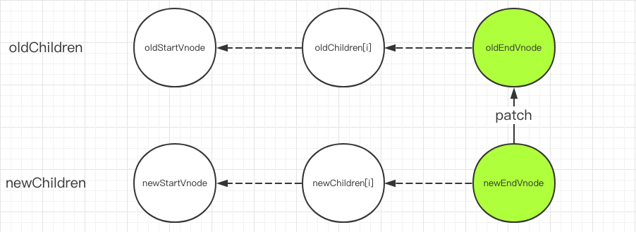
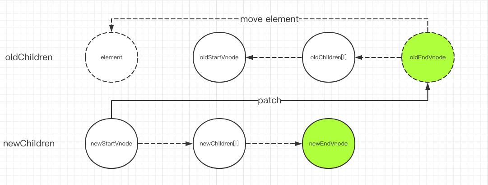

# Vue patch算法
1、patch算法核心思想是同层比较，不跨层，返回vnode.ele对应真实dom。
2、效果：设置key值在节点位置调换的情况下，可以复用dom节点.

------
核心三大算法：
> * patch算法
> * patchVnode算法
> * updateChildren算法

------

## patch算法

if vnode不存在但是oldVnode存在，说明意图是要销毁老节点，那么就调用invokeDestroyHook(oldVnode)来进行销
if oldVnode不存在但是vnode存在，说明意图是要创建新节点，那么就调用createElm来创建新节点
else 当vnode和oldVnode都存在时
if oldVnode和vnode是同一个节点，就调用patchVnode来进行patch
当vnode和oldVnode不是同一个节点时，如果oldVnode是真实dom节点或hydrating设置为true，需要用hydrate函数将虚拟dom和真是dom进行映射，然后将oldVnode设置为对应的虚拟dom，找到oldVnode.elm的父节点，根据vnode创建一个真实dom节点并插入到该父节点中oldVnode.elm的位置（***当不值得比较时，新节点直接把老节点整个替换了***）

## patchVnode算法

 1. 如果oldVnode跟vnode完全一致，那么不需要做任何事情
 2. 如果oldVnode跟vnode都是静态节点，且具有相同的key，当vnode是克隆节点或是v-once指令控制的节点时，只需要把oldVnode.elm和oldVnode.child都复制到vnode上，也不用再有其他操作
 3. 如果vnode是文本节点或注释节点，当vnode.text != oldVnode.text时，更新vnode.elm的文本内容
 4. 否则，如果vnode不是文本节点或注释节点
    1、如果oldVnode和vnode都有子节点，且2方的子节点不完全一致，就执行updateChildren
    2、如果只有oldVnode有子节点，那就把这些节点都删除
    3、如果只有vnode有子节点，那就创建这些子节点
    4、如果oldVnode和vnode都没有子节点，但是oldVnode是文本节点或注释节点，就把vnode.elm的文本设置为空字符串

## updateChildren算法
分别获取oldVnode和vnode的firstChild、lastChild，赋值给oldStartVnode、oldEndVnode、newStartVnode、newEndVnode
以下为条件判断分支：
如果oldStartVnode和newStartVnode是同一节点，调用patchVnode进行patch，然后将oldStartVnode和newStartVnode都设置为下一个子节点，

如果oldEndVnode和newEndVnode是同一节点，调用patchVnode进行patch，然后将oldEndVnode和newEndVnode都设置为上一个子节点，重复上述流程

如果oldStartVnode和newEndVnode是同一节点，调用patchVnode进行patch，如果removeOnly是false，那么可以把oldStartVnode.elm移动到oldEndVnode.elm之后，然后把oldStartVnode设置为下一个节点，newEndVnode设置为上一个节点，重复上述流程

如果newStartVnode和oldEndVnode是同一节点，调用patchVnode进行patch，如果removeOnly是false，那么可以把oldEndVnode.elm移动到oldStartVnode.elm之前，然后把newStartVnode设置为下一个节点，oldEndVnode设置为上一个节点，重复上述流程

如果以上都不匹配，就尝试在oldChildren中寻找跟newStartVnode具有相同key的节点，如果找不到相同key的节点，说明newStartVnode是一个新节点，就创建一个，然后把newStartVnode设置为下一个节点

如果上一步找到了跟newStartVnode相同key的节点，那么通过其他属性的比较来判断这2个节点是否是同一个节点，如果是，就调用patchVnode进行patch，如果removeOnly是false，就把newStartVnode.elm插入到oldStartVnode.elm之前，把newStartVnode设置为下一个节点，重复上述流程

如果在oldChildren中没有寻找到newStartVnode的同一节点，那就创建一个新节点，把newStartVnode设置为下一个节点，重复上述流程

如果oldStartVnode跟oldEndVnode重合了，并且newStartVnode跟newEndVnode也重合了，这个循环就结束了

在结束时，分为两种情况：
1.oldStartIdx > oldEndIdx，可以认为oldCh先遍历完。当然也有可能newCh此时也正好完成了遍历，统一都归为此类。此时newStartIdx和newEndIdx之间的vnode是新增的，调用addVnodes，把他们全部插进before的后边，before很多时候是为null的。addVnodes调用的是insertBefore操作dom节点，我们看看insertBefore的文档：parentElement.insertBefore(newElement, referenceElement)
如果referenceElement为null则newElement将被插入到子节点的末尾。如果newElement已经在DOM树中，newElement首先会从DOM树中移除。所以before为null，newElement将被插入到子节点的末尾。
2.newStartIdx > newEndIdx，可以认为newCh先遍历完。此时oldStartIdx和oldEndIdx之间的vnode在新的子节点里已经不存在了，调用removeVnodes将它们从dom里删除

