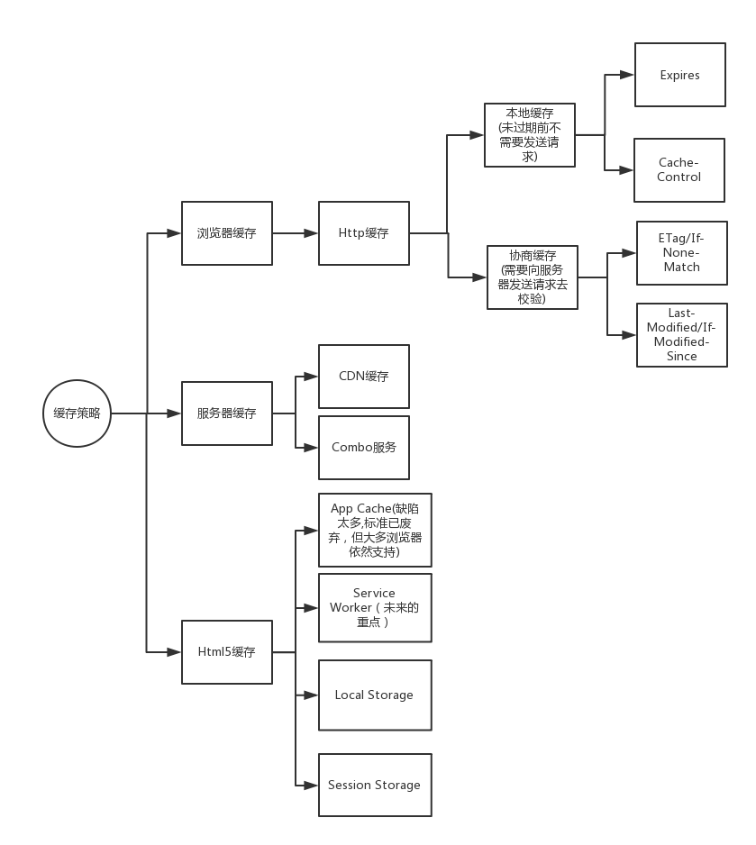

# 缓存

## 分类

## CDN
### CDN的优势
1. CDN节点解决了跨运营商和跨地域访问的问题，访问延时大大降低；
1. 大部分请求在CDN边缘节点完成，CDN起到了分流作用，减轻了源站的负载。

### CDN缓存的缺点
当网站更新时，如果CDN节点上数据没有及时更新，即便用户再浏览器使用Ctrl +F5的方式使浏览器端的缓存失效，也会因为CDN边缘节点没有同步最新数据而导致用户访问异常。

## Combo服务
Combo服务，也就是我们在最终拼接生成页面资源引用的时候，并不是生成多个独立的link标签，而是将资源地址拼接成一个url路径，请求一种线上的动态资源合并服务，从而实现减少HTTP请求的需求。
/??fle1,file2,file3,...的url请求响应就是动态combo服务提供的，它的原理很简单，就是根据url找到对应的多个文件，合并成一个文件来响应请求，并将其缓存，以加快访问速度。
### 但它也存在一些缺陷：
1. 浏览器有url长度限制，因此不能无限制的合并资源。
1. 如果用户在网站内有公共资源的两个页面间跳转访问，由于两个页面的combo的url不一样导致用户不能利用浏览器缓存来加快对公共资源的访问速度。
1. 如果combo的url中任何一个文件发生改变，都会导致整个url缓存失效，从而导致浏览器缓存利用率降低。

## 字段
|规则|消息报头|值/示例|类型|作用
|---|-------|------|----|---|
|新鲜度|Expires|Thu, 14 Dec 2017 20:30:50 GMT
|响应|告诉浏览器在过期前可以直接使用副本，无需发送请求（可能存在客户端时间不一致问题）,优先级低于 Cache-Control
||Pragma|no-cache(旧浏览器)|响应|告诉浏览器忽略缓存副本，强制每次请求直接发送给服务器
||Cache-Control|cache|响应|直接使用本地缓存，不发生请求
|||no-cache|响应|告诉浏览器忽略缓存副本，强制每次请求直接发送给服务器
|||no-store|响应|不允许缓存响应，每次请求都必须完整获取。
|||must-revalidate|响应|强制浏览器遵守已设置的缓存规则
|||proxy-revalidate|强制proxy严格遵守你设置的cache规则。
|||max-age|响应|指明副本的有效缓存时长，从请求开始到过期时间点之间的秒数
|||public|响应|任何缓存者（本地缓存或者中间代理）都可以缓存
|||privite|响应|只针对单个用户或者实体(不同用户，窗口)缓存资源
|||s-maxage|响应|与max-age相同，只针对代理有效，优先级高于max-age
||Last-Modified||响应|告诉浏览器资源的最后修改时间
||If-Modified-Since||请求|如果浏览器第一次请求时，响应中的Last-Modified非空，则在第二次请求时会把它作为该项的值发送给服务器
|校验值|ETag||响应|告诉浏览器该资源在服务器的唯一标识符（生产规则由服务器决定），优先级高于Last-Modified；如果有多台负载均衡的服务器，不同服务器计算出的Etag可能不同，这样就会造成资源的重复加载。
||If-None-Match||请求|如果浏览器第一次请求时，响应中的ETag非空，则在第二次请求时会把它作为该项的值发送给服务器
|辅助|Vary|Accept-Encoding|响应|辅助从多个缓存副本中筛选出合适的副本（不同压缩算法产生的副本）
## 用户操作与缓存
|用户操作|Expires/Cache-Control|Last-Modified/ETag|
|------|----------------------|------------------|
|地址栏回车|有效|有效|
|页面链接跳转|有效|有效|
|新开窗口|有效|有效|
|前进/后退|有效|有效|
|F5刷新|无效|有效|
|Ctrl+F5强制刷新|无效|无效|

## 更新缓存

  浏览器发出的所有 HTTP 请求会首先路由到浏览器缓存，以确认是否缓存了可用于满足请求的有效响应。如果有匹配的响应，则从缓存中读取响应，这样就避免了网络延迟和传送产生的流量费用。
  
浏览器缓存响应后，缓存的版本将一直使用到过期（由 max-age 或 expires 决定），或一直使用到由于某种其他原因从缓存中删除，例如用户清除了浏览器缓存。因此，构建网页时，不同的用户可能最终使用的是文件的不同版本；刚获取了资源的用户将使用新版本的响应，而缓存了早期（但仍有效）副本的用户将使用旧版本的响应。

所以客户端如何缓存和快速更新？您可以在资源内容发生变化时更改它的网址，强制用户下载新响应。通常情况下，可以通过在文件名中嵌入文件的指纹或版本号来实现 - 例如 style.x234dff.css。
### CDN更新

通过CDN供应商提供的账号和站点进行更新。
## 使用策略

不存在什么最佳缓存策略。您需要根据通信模式、提供的数据类型以及应用特定的数据更新要求，为每个资源定义和配置合适的设置，以及整体的“缓存层次结构”。

#### 在制定缓存策略时，您需要牢记下面这些技巧和方法：

1. 使用一致的网址：如果您在不同的网址上提供相同的内容，将会多次获取和存储这些内容。提示：请注意，网址区分大小写。
1. 确保服务器提供验证令牌 (ETag)：有了验证令牌，当服务器上的资源未发生变化时，就不需要传送相同的字节。
1. 确定中间缓存可以缓存哪些资源：对所有用户的响应完全相同的资源非常适合由 CDN 以及其他中间缓存进行缓存。
1. 为每个资源确定最佳缓存周期：不同的资源可能有不同的更新要求。为每个资源审核并确定合适的 max-age。
1. 确定最适合您的网站的缓存层次结构：您可以通过为 HTML 文档组合使用包含内容指纹的资源网址和短时间或 no-cache 周期，来控制客户端获取更新的速度。
1. 最大限度减少搅动：某些资源的更新比其他资源频繁。如果资源的特定部分（例如 JavaScript 函数或 CSS 样式集）会经常更新，可以考虑将其代码作为单独的文件提供。这样一来，每次获取更新时，其余内容（例如变化不是很频繁的内容库代码）可以从缓存获取，从而最大限度减少下载的内容大小。
2. 多用Get方式请求动态Cgi。
3. 动态CGI也是可以被缓存。

#### 综上，通常采取如下缓存策略：
1. 将html设为no-cache（通过meta标签设置），这样每次请求都会重新验证文档，并在内容改变时获取最新的版本。同时将html中引用的css与js资源的链接中嵌入指纹（例如 style.x234dff.css），这样一旦这些资源的内容发生变化，其链接也会发生变化，进而引起html内容的变化，从而下载最新版本的html副本。
2. 允许浏览器和中间缓存（例如 CDN）缓存 CSS，并将 CSS 设置为 1 年后到期。请注意，您可以放心地使用 1 年的“远期过期”，因为您在文件名中嵌入了文件的指纹：CSS 更新时网址也会随之变化。
3. JavaScript 同样设置为 1 年后到期，但标记为 private，这或许是因为它包含的某些用户私人数据是 CDN 不应缓存的。
4. 图像缓存时不包含版本或唯一指纹，并设置为 1 天后到期（这是Google Developers上的观点，个人认为通常可以和css采取同样的策略）。
5. 优先使用ETag结合max-age。

## 其他
[常见服务器的缓存配置样例](https://github.com/h5bp/server-configs)
### 200与304
* 如果命中本地缓存，浏览器不发任何 HTTP 请求，此时的状态码为200 from cache；
* 如果是协商缓存则会返回304 not modified

> HTML5缓存后续补充

### 参考
[Google DevelopersHTTP缓存](https://developers.google.com/web/fundamentals/performance/optimizing-content-efficiency/http-caching?hl=zh-cn)

[Cache-Control header checker检测站点的缓存策略并给出相关建议](http://highloadtools.com/cachecontrol)

[缓存策略](http://imweb.io/topic/55c6f9bac222e3af6ce235b9)
